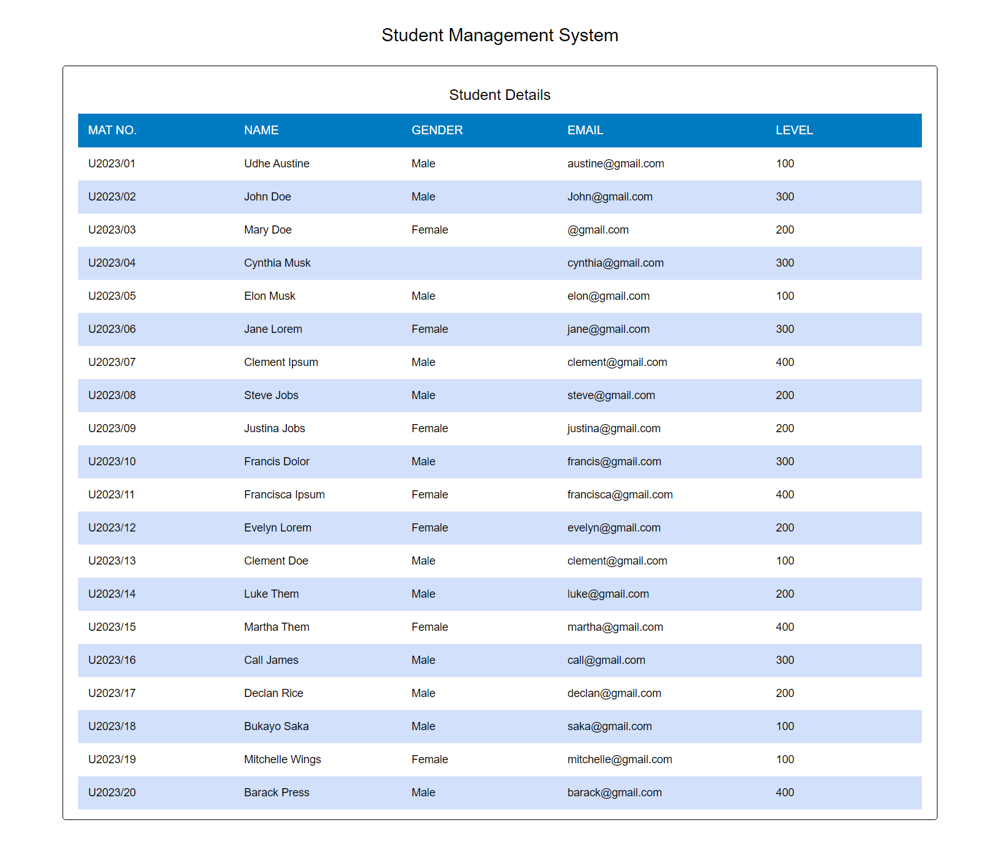

# Dev Career Task 1 - Tables

# Overview
Build a well responsive table with 20 records. Use just HTML and CSS, and push code to Github

# Built with
- HTML
- Custom CSS

# screenshots
- 

## Author

- Website - [Udhe Austine Ogaga](https://Austinet.github.io/portfolio/)
- LinkedIn - [Udhe Austine Ogaga](https://linkedin.com/in/udhe-austine-ogaga)
- Frontend Mentor - [@Austinet](https://www.frontendmentor.io/profile/austinet)
- Twitter - [@austineudhe](https://www.twitter.com/austineudhe)